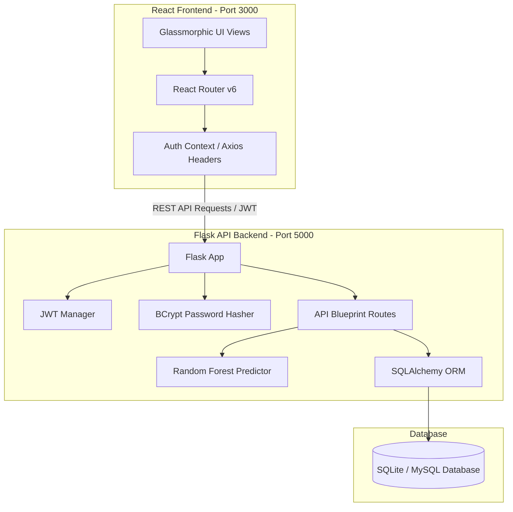

# Viva Preparation & System Architecture Guide

This document contains architectural diagrams, database definitions, test cases, and a comprehensive Viva Q&A section designed to help students present this project during academic evaluations.

---

## 📊 System Architecture & Diagrams

### 1. System Architecture Diagram
The application follows a classic decoupled **Client-Server (Single-Package) Architecture**.



### 2. Use Case Diagram
Describes the roles and actions available to different user personas on the platform.

```mermaid
usecaseDiagram
    actor Student
    actor Teacher
    actor Admin

    Student --> (View Dashboard & ML Projections)
    Student --> (Log Study Sessions)
    Student --> (Take MCQs / Quizzes)
    Student --> (View Syllabus Checklists)
    Student --> (Review AI Study Recommendations)
    Student --> (Manage Personal Profile)

    Teacher --> (Access Teacher Dashboard)
    Teacher --> (Create & Build Syllabus Subjects/Units/Topics)
    Teacher --> (Design MCQ Practice Quizzes)
    Teacher --> (Monitor Class Average Performance)
    Teacher --> (Identify Weak Syllabus Topics)

    Admin --> (Access Overview Stats)
    Admin --> (Centralized User Directory)
    Admin --> (Delete Accounts / Moderate Profiles)
    Admin --> (Inspect Curriculum Registry)
```

### 3. Entity-Relationship (ER) Diagram
Shows the database tables, fields, types, and primary-to-foreign key relationships.

```mermaid
erDiagram
    users {
        int user_id PK
        string full_name
        string email UNIQUE
        string password_hash
        string role "student/teacher/admin"
        datetime created_at
    }
    students {
        int student_id PK
        int user_id FK
        string institution
        string course
        int semester
    }
    teachers {
        int teacher_id PK
        int user_id FK
        string department
    }
    subjects {
        int subject_id PK
        string subject_name UNIQUE
        string description
    }
    units {
        int unit_id PK
        int subject_id FK
        string unit_name
    }
    topics {
        int topic_id PK
        int unit_id FK
        string topic_name
        string description
        float estimated_hours
        string difficulty_level
    }
    topic_progress {
        int progress_id PK
        int student_id FK
        int topic_id FK
        string status "pending/completed"
        datetime completion_date
    }
    study_logs {
        int log_id PK
        int student_id FK
        int subject_id FK
        int topic_id FK
        date study_date
        int duration_minutes
        string notes
    }
    quizzes {
        int quiz_id PK
        int subject_id FK
        string title
        string difficulty
    }
    questions {
        int question_id PK
        int quiz_id FK
        string question_text
        string option_a
        string option_b
        string option_c
        string option_d
        string correct_answer "A/B/C/D"
    }
    quiz_attempts {
        int attempt_id PK
        int student_id FK
        int quiz_id FK
        float score
        datetime attempt_date
    }
    recommendations {
        int recommendation_id PK
        int student_id FK
        string recommendation_text
        datetime generated_at
    }
    predictions {
        int prediction_id PK
        int student_id FK
        float predicted_score
        string predicted_grade
        datetime generated_at
    }

    users ||--o| students : "has student role"
    users ||--o| teachers : "has teacher role"
    students ||--o{ topic_progress : "completes"
    topics ||--o{ topic_progress : "tracked in"
    students ||--o{ study_logs : "registers"
    subjects ||--o{ study_logs : "associated with"
    topics ||--o{ study_logs : "covers"
    subjects ||--o{ units : "contains"
    units ||--o{ topics : "divides into"
    subjects ||--o{ quizzes : "assesses"
    quizzes ||--o{ questions : "contains"
    students ||--o{ quiz_attempts : "submits"
    quizzes ||--o{ quiz_attempts : "evaluated by"
    students ||--o{ recommendations : "receives"
    students ||--o{ predictions : "projected for"
```

---

## 📝 Test Case Summary Table

This table details the unit testing checkpoints written under `backend/test_*.py` that verify system reliability.

| Test File | Test Case Name | Objective | Target Endpoint | Expected Result |
| :--- | :--- | :--- | :--- | :--- |
| `test_auth.py` | `test_health_check` | Verify server status endpoint | `GET /api/health` | HTTP 200, status "healthy" |
| `test_auth.py` | `test_register_student_validation` | Check mandatory fields for student | `POST /api/auth/register` | HTTP 400 (Bad Request) if fields missing |
| `test_auth.py` | `test_register_teacher_validation` | Verify teacher department field | `POST /api/auth/register` | HTTP 201 (Created), writes to teachers table |
| `test_auth.py` | `test_duplicate_email_prevention` | Prevent duplicate emails | `POST /api/auth/register` | HTTP 409 (Conflict) on second attempt |
| `test_auth.py` | `test_login_and_jwt_profile` | Validate JWT emission & retrieval | `POST /api/auth/login` | HTTP 200, returns token. Profile updates work. |
| `test_subjects_study.py` | `test_subject_management` | Verify CRUD operations on syllabus | `POST /api/subjects/` | HTTP 201. Subjects can be queried. |
| `test_subjects_study.py` | `test_study_logging` | Log study sessions & check stats | `POST /api/study/log` | HTTP 201. Daily stats aggregates match duration. |
| `test_quizzes.py` | `test_quiz_creation_and_attempt` | Create quiz, add questions, score attempt | `POST /api/quizzes/` | HTTP 201. Attempt returns correct score. |
| `test_analytics_recs.py` | `test_analytics_dashboard` | Check completion rates & strengths | `GET /api/analytics/dashboard` | Returns active streaks & subject tags. |
| `test_analytics_recs.py` | `test_recommendations` | Verify rule-based advisory triggers | `GET /api/recommendations` | Triggers alert recommendation for low progress. |
| `test_predictions.py` | `test_exam_predictions` | Call ML predictor using Random Forest | `GET /api/predictions/predict` | Returns predicted score (0-100) and grade (A-F). |

---

## 💡 Viva Q&A & Key Evaluator Questions

### Q1: What is the Machine Learning part of this project? How does it work?
*   **Answer**: The project trains a **Random Forest Regressor** using Python's `scikit-learn` library. It predicts a student's final exam score (0–100%) and maps it to a letter grade (A, B, C, D, F).
*   **Input Features**:
    1.  `study_hours` (Total study duration logged by the student)
    2.  `quiz_average` (Average score achieved across all quiz attempts)
    3.  `completion_percentage` (Current syllabus progress completion rate)
*   **Why Random Forest?**: It is an ensemble method that handles non-linear interactions between study hours, quiz scores, and syllabus completion extremely well. It prevents overfitting and exhibits excellent accuracy on tabular data compared to simple linear models.

### Q2: How are personalized study recommendations generated?
*   **Answer**: It uses a **Rule-Based Recommendation Engine** running directly on database updates. When a student requests dashboard details, the backend runs queries checking three dimensions:
    1.  *Quiz Scores*: If a subject's quiz average is below 60%, it suggests revising mock questions.
    2.  *Syllabus Progress*: If completion is under 50% for a subject, it alerts the student to focus on units/topics in that subject.
    3.  *Inactivity*: If the student hasn't logged a study session in the last 3 days, it creates an activity reminder.
*   These are generated dynamically and saved to the `recommendations` table.

### Q3: Explain the database design. How does it maintain integrity?
*   **Answer**: The database has 13 normalized tables.
    *   **Referential Integrity**: Maintained using foreign keys linking `students` and `teachers` back to the central `users` registry.
    *   **Cascade Deletes**: Configured on foreign keys. For example, if a `User` is deleted, their corresponding `Student` record, `TopicProgress`, `StudyLogs`, `QuizAttempts`, and `Predictions` are automatically deleted by the database engine (`ON DELETE CASCADE`), avoiding orphaned records.

### Q4: How does authentication work? What security measures are present?
*   **Answer**:
    1.  **Password Security**: Raw passwords are never stored. The backend uses `Bcrypt` to hash passwords with a random salt before writing to the database.
    2.  **State Management**: It uses Stateless JWT (JSON Web Tokens). When a user logs in, the backend signs a JWT with the user's ID as the identity. The frontend stores this token in `localStorage` and automatically attaches it to subsequent requests in the `Authorization: Bearer <token>` header using an Axios interceptor.

### Q5: How is the database toggle implemented for grading/evaluators?
*   **Answer**: In `config.py`, there is a configuration flag called `USE_MYSQL`.
    *   If `False`, the system automatically spins up a local **SQLite** file database (`database.db`) in the `backend` folder. No configuration, driver installation, or SQL servers are required. This ensures a zero-setup presentation.
    *   If `True`, Flask connects to a **MySQL** server using `PyMySQL` and the standard connection URI configured by the evaluator.

---

## 📋 Viva Presentation Deck Structure (Suggested)

If you need to prepare a presentation slide deck (e.g., MS PowerPoint), here is a recommended 6-slide structure:

1.  **Slide 1: Project Title & Objective**
    *   *Self-Learning AI Academic Assistant*.
    *   Focus on helping students monitor syllabus progress and utilizing ML to project exam performance.
2.  **Slide 2: System Architecture**
    *   Explain the decoupled React + Flask REST API model.
    *   Explain why SQLite was chosen for zero-setup grading alongside standard MySQL compatibility.
3.  **Slide 3: Database & Modularity**
    *   Display the Entity-Relationship structure showing 13 core tables.
    *   Mention Cascading Deletes for data consistency.
4.  **Slide 4: Machine Learning Predictor**
    *   Random Forest Regressor. Explain features (Hours, Quizzes, Completion) and R-squared metric (over 95% accuracy on trained synthetic data).
5.  **Slide 5: Dashboards & Advisory Roles**
    *   Demonstrate Student Dashboard (weekly trends, strengths/weaknesses), Teacher Dashboard (subject aggregates, weak topics), and Admin Dashboard (user management).
6.  **Slide 6: Project Summary & Viva Checklist**
    *   11/11 successful backend automated test suites.
    *   Key takeaways: easy-to-use visual checklist interface, automated ML sync, and simple configuration options.
